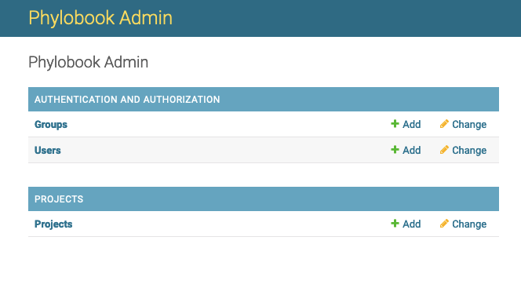
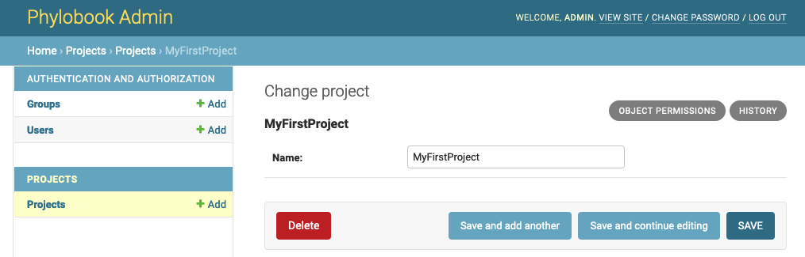
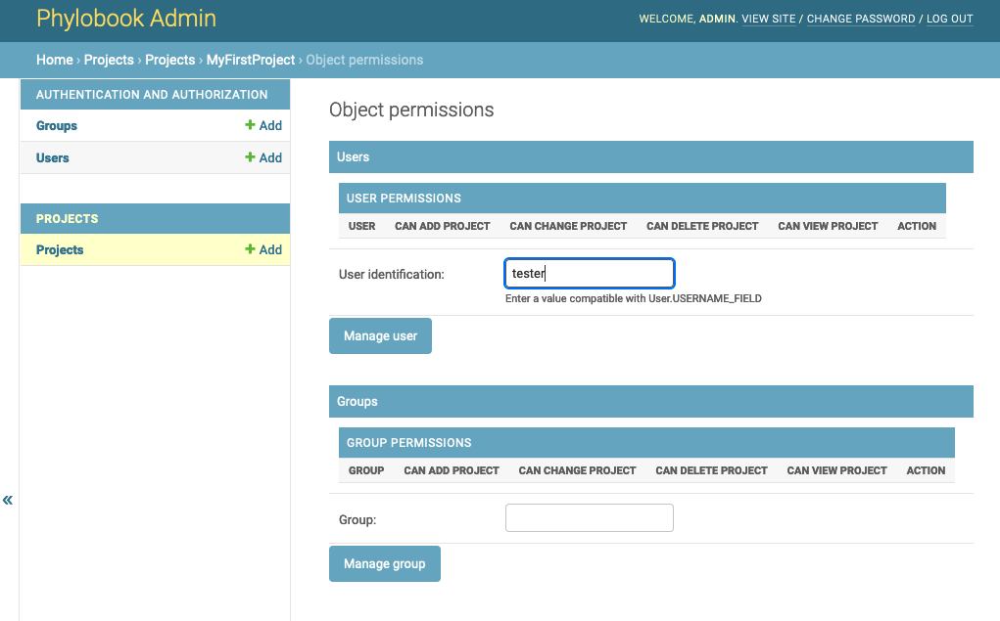
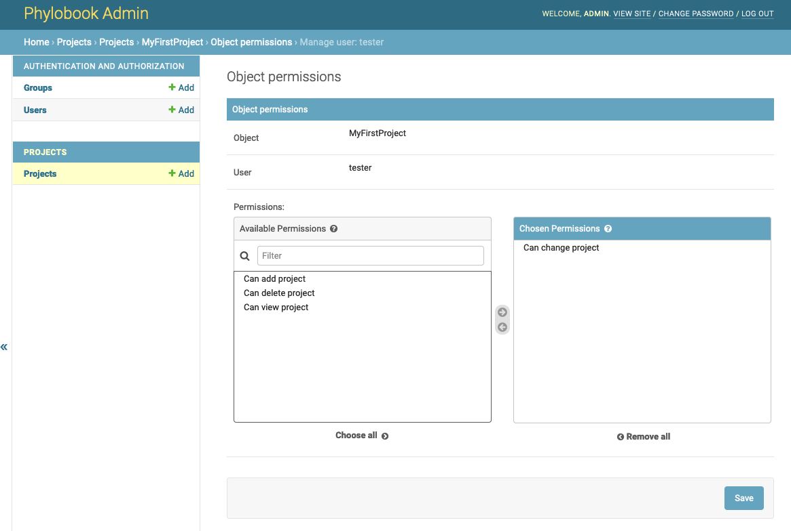

# Phylobook

Install **Docker** on host server:
https://docs.docker.com/get-docker/

**Docker Compose** is an additional tool that is automatically included with Mac and Windows downloads of Docker. However if you are on Linux, you will need to add it manually. You can do this by running the command `sudo pip install docker-compose` after your Docker installation is complete.

## Installation and Configuration

You should identify two different folders on your host system.  First you need an installation folder to install Phylobook from.  Secondly, you need to have a folder where you will store the phylogenetic tree data that Phylobook displays (Phylobook looks for this folder in the PROJECT_PATH variable set in the .env file) 

In your installation folder, enter the following commands in a terminal shell

`git clone https://github.com/MullinsLab/phylobook.git`

`cd phylobook`

Create .env by copying .env.TEMPLATE

`cp .env.TEMPLATE .env`

Edit config.env and add your specific settings

`nano .env`

These are the settings that are set in the .env file.  They are settings that are unique to your own environment:

    # Add a unique secret key string. For more information see https://docs.djangoproject.com/en/4.0/ref/settings/#secret-key
    # Secret key is a unique key that you are required to provide to Django.  
    # If you have python3 installed on your system, you can issue the following command to generate a secret key:
    # python3 -c 'from django.core.management.utils import get_random_secret_key; print(get_random_secret_key())'
    SECRET_KEY=
    
    # Set debug off (0) or on (1)
    # If this is set to 1, then errors will be displayed in the client browser window.  Set to 1 if you are needing to debug a problem.
    # Default is 0.
    DEBUG=0
    
    # Set the hosts (separated by a space) that are allowed to access this application.  
    # Default is "localhost 127.0.0.1" which limits to only localhost requests.  
    # If you are using a domain name for public use, you will need to add it to the list.
    # E.g. localhost 127.0.0.1 myserver.domain.com
    DJANGO_ALLOWED_HOSTS=localhost 127.0.0.1
    
    # Set the path to the data directory.  This is where Phylobook finds the project folders to display.
    # E.g. /data
    PROJECT_PATH=
    
    # Set the server name
    # E.g. phylobook.mullins.microbiol.washington.edu
    SERVER_NAME=
    
    # Set the email settings for password reset emails
    # These settings are used for password reset email requests.  If you are running a stand-alone installation, you can leave the settings as is.
    # Below is an example of the configuration of EMAIL_HOST, EMAIL_USE_TLS, EMAIL_PORT for office365 exchange.
    # In the case of office365, EMAIL_HOST_USER is an email address and EMAIL_HOST_PASSWORD is obviously the password.
    # Other email host settings may vary, please add your host specific email settings.
    EMAIL_HOST=outlook.office365.com
    # EMAIL_USE_TLS (1 or 0) 1=True 0=False
    EMAIL_USE_TLS=1
    EMAIL_PORT=587
    EMAIL_HOST_USER=
    EMAIL_HOST_PASSWORD=
    
    # DB configuration
    # Add a password to DB_PASS.
    DB_USER=postgres  # Use custom name or leave as "postgres"
    DB_NAME=postgres # Use custom name or leave as "phylobook"
    DB_PASS=          # Add a secure password for the database
    
    # There are 3 types of LOGIN_TYPE authentication - "local" (default), "sso", and "dual".  
    # An IT professional will be required to configure "sso" and "dual".  If you are not familiar with SAML, please leave the default "local".
    # Please choose the one that you prefer:
    # local - locally managed accounts with passwords stored encrypted (default)
    # sso - SAML supported single sign on only
    # dual - supports both single sign on and locally managed acounts
    LOGIN_TYPE=local
    
    # Do not change this setting.
    LOGIN_URL=/login
    
    # For LOGIN_TYPE=dual, uncomment and change the labels to fit your institution
    #LOGIN_SSO_TITLE=UW Login >>
    #LOGIN_SSO_COLLABORATOR_TITLE=Collaborator account:

Notes for specifically for LOGIN_TYPE "sso" or "dual".  LOGIN_TYPE "local" should skip this block:

---
If you chose LOGIN_TYPE=sso or LOGIN_TYPE=dual in config.env, then you must create settings/saml.py by copying settings/saml.py.TEMPLATE

`cp settings/saml.py.TEMPLATE settings/saml.py`

Edit settings/saml.py and add your institution's SAML configuration and certificates

`nano settings/saml.py`

---

Build and deploy the containers

`docker-compose up -d --build`

Perform initial database migrations

`docker exec -it phylobook python manage.py migrate --settings=phylobook.settings.prod`

Create super user

`docker exec -it phylobook python manage.py createsuperuser --settings=phylobook.settings.prod`

Login to the server http://localhost:8000/ using the super user account credentials that you have created.

In the upper right corner of the browser window, there is an "Admin" link.  Click the link and you will enter the Administrator module.  

Add a new "Project". The project name should match a folder name at the top level of the PROJECT_PATH that was entered in .env file.

The project folder should contain all of the output from PhyML, figtree-enhanced-command-line, and highlighter_bot.

The data for many samples can be under a single project.  Permissions are managed at the level of a project.  All project contents will have the same permissions.  

Here is an example project folder (Project name "MyFirstProject") and its contents.  This example has all the data files for a single sample, sample_001_tp1-tp2-tp3:

    {PROJECT_PATH}/MyFirstProject
    ├── sample_001_tp1-tp2-tp3.fasta
    ├── sample_001_tp1-tp2-tp3.json
    ├── sample_001_tp1-tp2-tp3.phy
    ├── sample_001_tp1-tp2-tp3.phy_log.txt
    ├── sample_001_tp1-tp2-tp3.phy_phyml.txt
    ├── sample_001_tp1-tp2-tp3.phy_phyml_stats.txt
    ├── sample_001_tp1-tp2-tp3.phy_phyml_tree.txt
    ├── sample_001_tp1-tp2-tp3.phy_phyml_tree.txt.svg
    ├── sample_001_tp1-tp2-tp3.phy_phyml_tree.txt_newick.tre
    ├── sample_001_tp1-tp2-tp3.phy_phyml_tree.txt_nexus.tre
    ├── sample_001_tp1-tp2-tp3.phy_pwcoldist.txt
    ├── sample_001_tp1-tp2-tp3.phy_pwdiversity.txt
    ├── sample_001_tp1-tp2-tp3_highlighter.png
    └── sample_001_tp1-tp2-tp3_highlighter.txt

By default, a super user can see all projects and create users and groups.  Users and groups follow the traditional model.  Once created, users and groups can be assigned permissions within the "Object Permissions" for any given Project object.  This is performed by clicking a Project in the list of Projects and then clicking "Object Permissions".

Select the user or group to assign permissions to, and click the "Manage user" or "Manage group" button.

Set the permissions for a user or group.  Phylobook uses the default permissions provided by a custom permission object in Django.  Of these permissions, only two matter to Phylobook:  "Can change project" and "Can view project".  If a user or group has "Can change project" permission, then they are able to have access to the full set of annotation tools and can edit and save changes.  Users or groups with "Can view project" permission are only able to view the projects contents and have no ability to save any new information.

---------

## For Developers

Install PyCharm

`git clone https://github.com/MullinsLab/phylobook.git`

Create a project from the source.  Add a virtual environment to the project and install the requirements.txt.

`pip3 install -r requirements.txt`

*Note to  Mac users:  xmlsec, lxml, psycopg2 may require you to install or update Xcode Command Line Tools. 

Edit settings/local.py and fill in PROJECT_PATH (location of project/data files) EMAIL settings for you environment.

Perform initial database migrations

`python3 manage.py migrate --settings=phylobook.settings.prod`

Create super user

`python3 manage.py createsuperuser --settings=phylobook.settings.prod`

Run the server from the terminal

`python3 manage.py runserver 0.0.0.0:3030 --settings=phylobook.settings.local`

----

*Notes for SSO users:  Creating a user, at this point, has to be done at the manage.py shell.  Here is example code for adding externally authenticated users.  Once the externally authenticated user is created in  the shell, the user will appear in the admin module where permissions can be assigned.

`python3 manage.py shell`

`from django.contrib.auth.models import User`				

`user = User(username='user_name')`

`user.set_unusable_password()`

`user.is_staff = False`

`user.is_superuser = False`

`user.save()`

`quit()`

